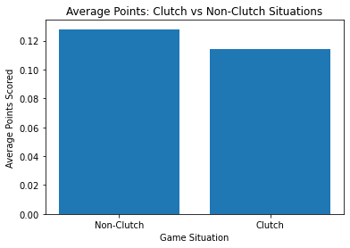
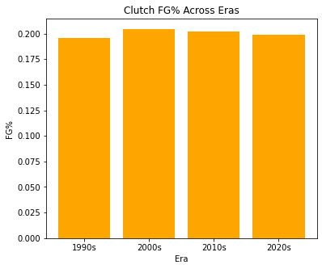

# NBA Clutch Performance Analysis

A PySpark-based big-data project that analyzes NBA play-by-play data to study clutch scoring, player efficiency, usage patterns, and era effects.

> **Course:** DS/CMPSC 410 — Fall 2025  
> **Team:** Full Court Insights

## Overview

Professional basketball produces large volumes of event-level data spanning shots, rebounds, assists, steals, blocks, turnovers, fouls, game context, and player metadata. This project uses distributed processing with Apache Spark to transform NBA play-by-play logs into player-level clutch statistics and era-level summaries.

The broader course project asked which players would stand out if performance were evaluated from play-by-play data rather than media narrative alone. The code included in this repository focuses on the implemented data pipeline and analytics foundation: ingestion, event feature engineering, clutch filtering, player rankings, efficiency/usage analysis, era comparisons, and visualization.

## Project Highlights

- Processes **1.35M+ play-by-play events** reported in the course materials.
- Uses **PySpark DataFrames** for cleaning, joins, filtering, aggregation, and feature engineering.
- Downloads the source dataset programmatically through **KaggleHub**.
- Defines clutch situations as **4th quarter + score margin within ±5 + 5 minutes or less remaining**.
- Produces player-level clutch totals, FG%, FT%, possessions used, points per possession, and usage per game.
- Compares high-usage/low-efficiency and low-usage/high-efficiency player groups.
- Aggregates clutch performance across the **1990s, 2000s, 2010s, and 2020s**.
- Stores intermediate/derived datasets as **Parquet**.

## Dataset

Source: **NBA Basketball** dataset by Wyatt Walsh on Kaggle  
Dataset identifier: `wyattowalsh/basketball`

The pipeline uses:

- `play_by_play.csv`
- `game.csv`
- `common_player_info.csv`

The raw dataset is not committed to this repository because of its size. It is downloaded by the pipeline with:

```python
kagglehub.dataset_download("wyattowalsh/basketball")
```

## Pipeline

```text
Kaggle NBA Dataset
        |
        v
PySpark ingestion
        |
        v
Cleaning + game/player joins
        |
        v
Event feature extraction
        |
        v
Clutch-event filter
(4Q, ±5 points, <=5:00)
        |
        v
Player-level aggregation
        |
        +--------------------+
        |                    |
        v                    v
Rankings + efficiency    Era analysis
        |                    |
        +---------+----------+
                  v
             Visualizations
```

## Key Metrics

The notebook derives or uses metrics including:

- clutch points
- clutch field-goal makes/misses and FG%
- clutch free-throw makes/misses and FT%
- assists, rebounds, steals, turnovers
- clutch possessions used
- points per possession
- usage per clutch game
- era-level points per game / points per event

## Source-Reported Results

The original notebook/course presentation reports the following outputs from the analyzed dataset:

| Analysis | Result |
|---|---|
| Highest total clutch points | LeBron James — 1,509 |
| #2 clutch points | Kobe Bryant — 1,192 |
| #3 clutch points | Kevin Durant — 986 |
| Highest clutch FG% with min. 50 FGA | Andris Biedrins — 48.7% |
| 1990s clutch scoring baseline | 5.05 points/game |
| 2020s clutch scoring baseline | 5.63 points/game |

These values are **outputs of the source project/data pipeline**, not claims about official NBA all-time records. See [`docs/REPRODUCIBILITY_NOTES.md`](docs/REPRODUCIBILITY_NOTES.md) for validation notes.

## Visualizations

### Final two minutes vs. earlier portion of the 5-minute clutch window



The source notebook creates this chart from the already-filtered `clutch_events.parquet` dataset, so it compares the final two minutes with the earlier part of the same five-minute clutch window.

### Clutch FG% by era



## Repository Structure

```text
.
├── README.md
├── CONTRIBUTIONS.md
├── requirements.txt
├── .gitignore
├── notebooks/
│   ├── nba_clutch_performance_analysis.ipynb
│   └── original_course_notebook.ipynb
├── src/
│   ├── 01_data_setup.py
│   ├── 02_clutch_engineering.py
│   ├── 03_player_clutch_stats.py
│   ├── 04_rankings_era_analysis.py
│   └── 05_visualizations.py
├── figures/
│   ├── clutch_window_comparison.png
│   └── clutch_fg_pct_by_era.png
├── data/
│   └── README.md
├── processed_data/
│   └── README.md
└── docs/
    ├── final_report.pdf
    ├── presentation.pdf
    └── REPRODUCIBILITY_NOTES.md
```

## Setup

### 1. Clone the repository

```bash
git clone <your-repository-url>
cd NBA-Clutch-Performance-Analysis
```

### 2. Create a virtual environment

```bash
python3 -m venv .venv
source .venv/bin/activate
```

### 3. Install Python dependencies

```bash
pip install -r requirements.txt
```

PySpark also requires a compatible Java installation.

## Run the Pipeline

The modular scripts can be run in order:

```bash
python src/01_data_setup.py
python src/02_clutch_engineering.py
python src/03_player_clutch_stats.py
python src/04_rankings_era_analysis.py
python src/05_visualizations.py
```

Or open the cleaned notebook:

```bash
jupyter notebook notebooks/nba_clutch_performance_analysis.ipynb
```

## My Contributions — Vansh Koul

My role in the team project focused on **formal analysis and visualization**, including:

- clutch player rankings
- efficiency analysis
- era-bias evaluation
- presentation plots
- summary tables

The full team credit statement is preserved in [`CONTRIBUTIONS.md`](CONTRIBUTIONS.md).

## Scope and Limitations

The course report discusses MLlib-based MVP vote-share modeling as a project objective. The notebook included here contains the implemented ETL, feature-engineering, ranking, efficiency, and era-analysis work, but **does not include a complete trained/evaluated MVP prediction model**.

The original notebook also reports a clutch-filtered row count very close to the report's total event count; this should be revalidated when reproducing the pipeline against the current Kaggle dataset version. Additional details are documented in [`docs/REPRODUCIBILITY_NOTES.md`](docs/REPRODUCIBILITY_NOTES.md).

## Team

Full Court Insights:

- Ryan Le
- Anoop Ibrampur
- Vansh Koul
- Abdulrahman Osilan
- Siddarth Gupta

## References

- Kaggle NBA dataset: https://www.kaggle.com/datasets/wyattowalsh/basketball
- NBA Stats: https://www.nba.com/stats
- Basketball Reference: https://www.basketball-reference.com
- ESPN NBA Stats: https://www.espn.com/nba/stats
